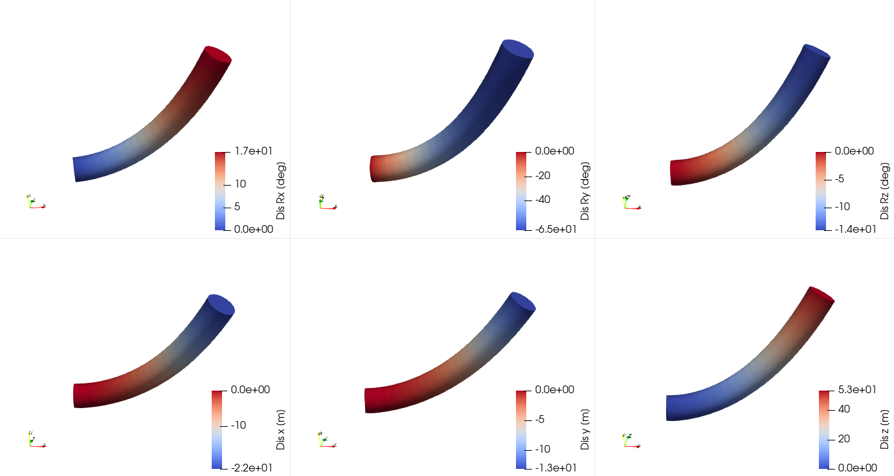
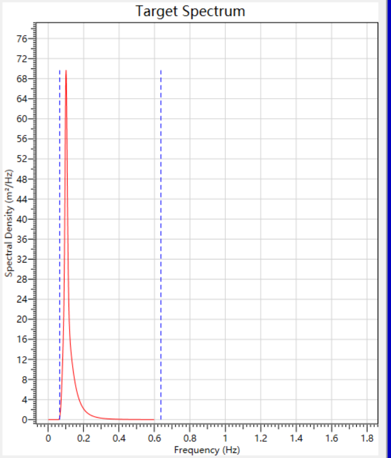
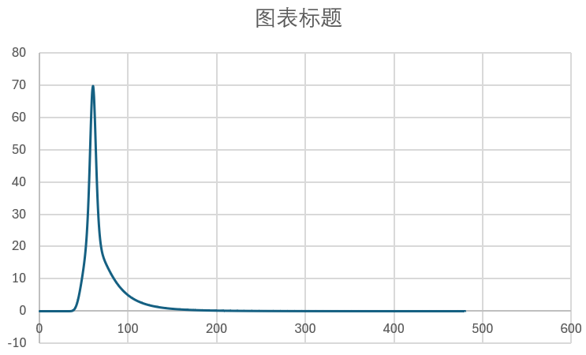
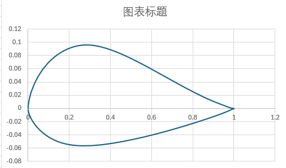
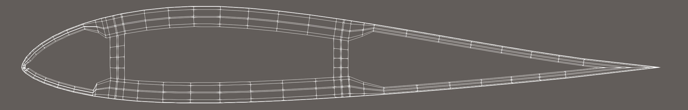
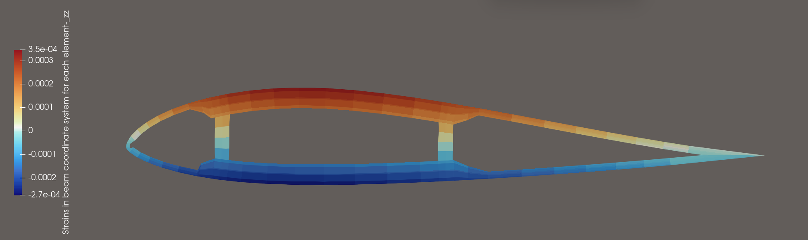
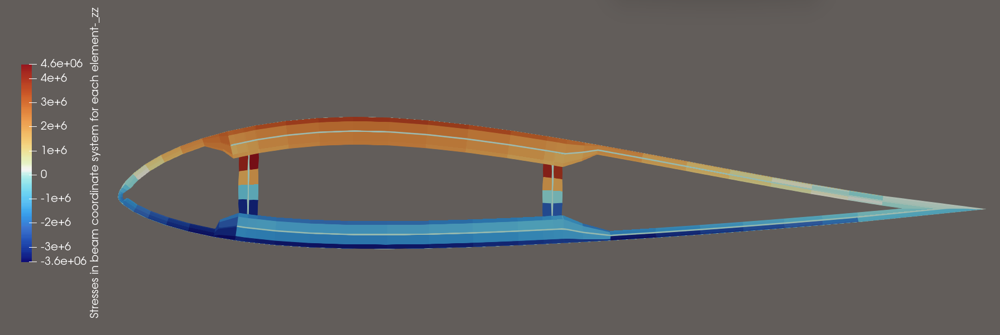
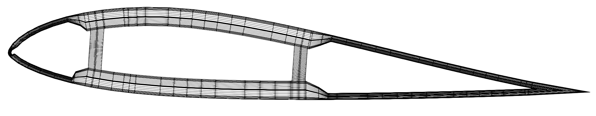
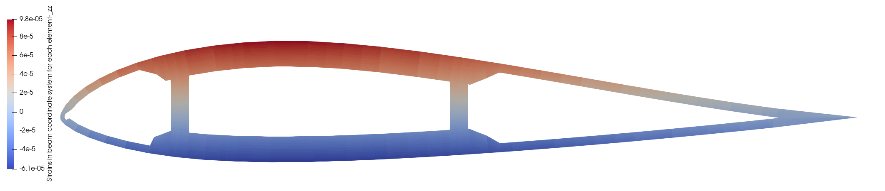
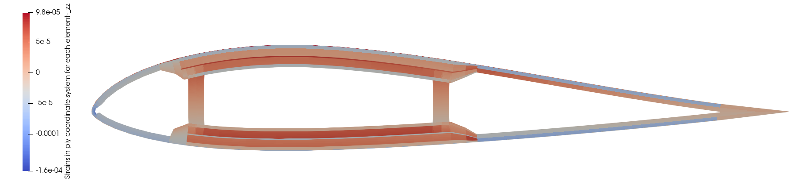

### [简体中文](./README.md) | [繁體中文](./README_FCN.md) | [English](./README_EN.md) | [日本語](./README_JP.md) | [한국어](./README_KO.md)

## 如果你想获取完整代码，并参加HawtC2的开发，请加入我们的组织

## HawtC 优势

### 理论创新

- 1、基于四元数的运动学变换方法，打破FAST[^1] /Bladed的小角度假设，实现了高精度运动描述和计算
- 2、具有自主知识产权的截面特性计算方法，打破IVABS 和BECAS 的长期垄断
- 3、全耦合的高效多目标优化算法，支持气动-结构-控制-水动力全流程优化设计，打破传统人工优化设计的低效性
- 4、基于共旋方法建立了各向异性几何非线性共旋梁方法，打破了传统拉格朗日方法和几何精确梁方法的低效性，实现了少分段、大步长、高精度的叶片非线性计算。
- 5、首次基于Kane方法推导了叶片、塔架TMDI的运动学和动力学公式，并将其耦合到了多体动力学当中，实现了气动-结构-控制-水动力-TMDI控制的全链路耦合计算。借助接口模型APIL与多目标优化模块MoptL实现了复杂风-波-浪耦合的叶片TMDI多目标优化设计
- 6、提出了实时数据驱动与多目标耦合的优化算法,通过建立真实数据参考向量,解决了传统数据驱动方法预测结果差,模型泛化能力弱的问题,大幅提高了优化效率和预测精度.
- 7、攻克了叶片铺层(结构设计)-叶片翼型应力(安全性设计)-叶片气动(高效气动外形设计)的超长柔性叶片耦合设计难题，实现了大型机组的翼型-叶片-整机耦合的设计方法，并提供了建模和仿真工具。

### 技术创新

- 1、完全的100%基于c#的原生代码，采用面向对象的编程形式，打破仿真软件的国外垄断
- 2、具有完全的CLI系统、支持界面/命令双向操作的面向开发者的可执行命令
- 3、提供了面向Python/c++等用户的动态链接库和手册支持，方便与其他软件耦合

## 0、How To Use?

HawtC 是部分开源且免费使用的计算软件，需要您申请免费的许可证来使用，我们提供了自动化的许可证管理系统，您只需要登录我们的

网站：http://www.hawtc.cn 或 http://www.openwecd.fun/ 获取支持！

## 🧑‍💻 Contributors

  <h2>✨ 贡献者</h2>
  
  
  <h2>🌐 语言</h2>
  

## 01、当前开发进度与功能

我们的目标是实现Bladed的全工况覆盖，并逐步开发UI界面（技术验证已经完成！，使用C# AOT来实现界面，可下载HawtC.UI来体验预览）
与Bladed的模块功能对比实现进度：

#### 01.1 功能与模块对比

|        Bladed模块        |    OpenFAST对应模块    |              HawtC对应模块              |                      HawtC完成进度与支持情况                      |               HawtC模型               |
| :----------------------: | :--------------------: | :--------------------------------------: | :---------------------------------------------------------------: | :-----------------------------------: |
|      Modal Analysis      | Bmodes(非OpenFAST模块) |                  BeamL                  |                       ✅基本实现，还在开发                       |          ✅CR/✅TK/⚠️GEBT          |
|     Wind Turbulence     |        TurbSim        |              WindL.SimWind              |                              ✅完成                              |          谐波叠加、风谱模型          |
|  Earthquake Generation  |       Earthquake       |                 SubFEML                 |                         ❌ 已规划，未开发                         |              线性有限元              |
|        Sea State        |   Sea State(V4.0.0)   |               HydroL.WaveL               |                              ✅完成                              |             JS/PM 谱模型             |
|        水动力模块        |        HydroDyn        |                 HyderoL                 |                        ⚠️只支持Spar平台                        | ❌势流理论（计划开发）、✅Morison方程 |
| Aerodynamic Information |        AeroDyn        |               AeroL/BeamL               |                              ✅完成                              |       BEMT/FVM 以及动态失速Oye       |
| Performance Coefficients | AeroDyn(不支持柔性Cp) |               AeroL/BeamL               |              ✅完成,❌ 柔性Cp未开发，可以使用MBD平替              |                   -                   |
|    Steady Power Curve    |        AeroDyn        |                 TurbineL                 |                              ✅完成                              |                   -                   |
| Steady Operational Loads |        AeroDyn        |                 TurbineL                 |                              ✅完成                              |                   -                   |
|   Steady Parked Loads   |        AeroDyn        |                 TurbineL                 |                              ✅完成                              |              浮动坐标法              |
|   Model Linearisation   |       FAST主模块       |              MSAL/TurbineL              |                      ⚠️ 正在开发当中。。。                      |                   -                   |
|  Electrical performance  |           -           |                    -                    |                             ❌ 不支持                             |                   -                   |
| Power Production Loading |   BeamDyn/ElastoDyn   | AeroL/MBD /ControL /HydroL/SubFEML/BeamL |                              ✅完成                              |               耦合模型               |
|       Normal Stop       |           -           | AeroL/MBD /ControL /HydroL/SubFEML/BeamL |          ⚠️ 可以模拟，但是没有直接提供功能选择，开发中          |               耦合模型               |
|      Emergency Stop      |           -           | AeroL/MBD//ControL /HydroL/SubFEML/BeamL |             ❌ 错误控制模块位于ControL当中，尚未开发             |               耦合模型               |
|          Idling          |   BeamDyn/ElastoDyn   |             AeroL/MBD /BeamL             |                              ✅完成                              |               耦合模型               |
|          Parked          |   BeamDyn/ElastoDyn   |     AeroL/MBD /HydroL/SubFEML/BeamL     |                              ✅完成                              |               耦合模型               |
|      Hardware Test      |           -           |                    -                    |                             ❌ 不支持                             |                   -                   |
|     Post Processing     |           -           |                  PostL                  | ✅ 部分支持（年发电量、疲劳载荷，极限载荷，雨流计数以完全支持！） |      S-N疲劳损伤理论、雨流计数法      |
|        Bladed API        |       pyOpenFAST       |                   APIL                   |                     外部应用接口，独有且便捷                     |                   -                   |
|          Batch          |       ❌ 不支持       |                  Batch                  |        ⚠️ 支持大部分工况的批次处理和运行，但代码尚未完善        |                   -                   |

#### 01.2 独有功能

| Bladed模块 |              OpenFAST模块              |         HawtC对应模块         |                 功能                 |                原理与模型                |
| :---------: | :-------------------------------------: | :---------------------------: | :----------------------------------: | :--------------------------------------: |
|  ❌不支持  |          IVABS(非OpenFAST模块)          |            ✅ PCSL            |       梁截面参数计算工具，独有       |                   FEM                   |
|  ❌不支持  |                ❌不支持                |           ✅ MoptL           |     多目标并行优化算法程序，独有     |   NSGA2/GDE3/MCell(改进的多线程c#实现)   |
|  ❌不支持  |                ❌不支持                |         ✅ APIL/MoptL         |      整机全参数一体化优化，独有      |                 耦合模型                 |
|  ❌不支持  |                ❌不支持                |         ✅ WTAI/MoptL         | 数据驱动与实时数据驱动代理模块，独有 |    Python、C++接口以及内置BP神经网络    |
|  ❌不支持  |               ✅ VTK支持               |            ✅ VTKL            |        数据显示与动画输出模块        |                    -                    |
| ❌只支持TMD | ⚠️只支持TMD(支持基础/塔架/叶片等结构) | ✅ TMD/TMDI(独有叶片)/陀螺仪 |     TMD/TMDI/陀螺仪下的减振计算     | MBD/FEM 多体动力学-有限元耦合模型的耦合 |

## HawtC 与 OpenFAST/Bladed 4.11 计算验证对比

### 1. 与OpenFAST对比的陆上IEA 15MW 稳态无风剪切验证

#### 1）验证结果

http://www.openwecd.fun/data/稳态无风剪切Compare.html

#### 2）验证程序

http://www.openwecd.fun/data/稳态Compare.ipynb

### 2.与OpenFAST对比的陆上IEA 15MW 湍流风的验证

#### 1）验证结果

http://www.openwecd.fun/data/湍流Compare.html

#### 2）验证程序

http://www.openwecd.fun/data/湍流Compare.ipynb

### 3.HawtC.AeroL 气动力模块 与 Bladed 4.11 计算验证对比

### 4.HawtC.MBD.VTK 多体动力学可视化的NREL 5MW Spar海上漂浮式风力机测试

#### HAWTC.FARM:

### 5.HawtC.BeamL 非线性梁(3D共旋梁理论)模块的验证

### 6.HawtC.HydroL.Wave 水动力波浪生成模块验证

该模块已经通过了与Bladed 4.11的验证,如下图所示:左面为Bladed4.11的波浪谱,有图为HawtC2计算的波浪谱.

| Blade                                                                       | HawtC                                                                       |
| --------------------------------------------------------------------------- | --------------------------------------------------------------------------- |
|  |  |

### 7.HawtC.HydroL.MoorL 水动力波浪生成模块验证

该模块完全耦合了OpenMoor[^2]与MoorDyn[^3]模块,以计算系泊力.同时，我们自己的系泊动力学MoorL模块还在开发当中，以支持风场状态下的共享系泊。

图片来源于[http://openmoor.org/](http://openmoor.org/)

### 8.HawtC.PCSL 截面特性计算验证

Beta V2.0.014及其之后版本支持FEM方法计算截面特性以及翼型网格自动化算法,输入文件参考了PreComp开源软件的输入格式,但是算法完全不一致.该软件包支持API函数自定义计算实现.

#### 案例1 典型截面的自定义网格分析(以矩形横截面分析)

##### 1、输入文件定义:

主输入文件

##### 2、材料输入文件定义:

材料输入文件

##### 3、PCSL 计算:

案例网格:

计算结果:

该算例以和BECAS交叉验证,计算结果完全一致!

#### 案例2 异形截面的自动化网格生成与计算(以翼型为例)

##### 1、输入主文件定义:

主输入文件

初始的翼型上下弦线几何外形为:

##### 3、基于PCSL网格自动化算法生成的网格为:

###### 3.1 截面特性分析计算:

计算结果

###### 3.2 截面应力与应变分析:

PCSL支持外部力输入下的截面应力/应变计算及其失效分析计算方法.
上述翼型的应力/应变以及失效分析主文件:

应变分析:

应力分析:

网格自动加密:

失效分析:

##### 4、当前的问题

当前V2.0.014版本采用Q4单元对截面进行离散，当前模型不能考虑高阶插值函数，使得与弯曲和剪切相关的系数计算精度相对较差(但远比PreComp精确)。该问题我们将在2.0.015版本当中引入Q8单元来解决。但是,为了加速计算,我们考虑到叶片单元的闭合壳结构和叶片的小应变特点,我们在代码当中忽略了截面翘曲的能量.如果需要计算非闭合截面,请等待年度更新的V2.1.000 大版本!

### 9.HawtC.WindL.SimWind 湍流风生成模块验证

该模块与OpenFAST.TurbSim 模块功能类似,下面是ETM风模型:

### 10.HawtC.MoptL 整机一体化优化模块数据驱动脚本

请查阅文件,了解范例接口:

- 脚本类语言接口(Python/R/Julia/Matlab):
  BP神经网络模型:[DemoBPNetWork.py](./data/Mopt/Python脚本/DemoBPNetWork.py)

  自然神经网络模型:[DemoBPNetWork.py](./data/Mopt/Python脚本/DemoBPNetWork.py)
- 编译形语言接口(C/C++/Fortran/c#):

  c++接口模版:[MoptL数据驱动案例.sln](./data/Mopt/C++脚本/MoptL数据驱动案例/MoptL数据驱动案例.sln)

## 源代码下载

请访问[www.HawtC.cn](http://www.openwecd.fun/)

## 交流论坛

交流论坛 http://www.openwecd.fun:22304/

#### 参考文献

[^1]: https://github.com/OpenFAST/openfast
    
[^2]: Chen, L., Basu, B. & Nielsen, S.R.K. (2018). A coupled finite difference mooring dynamics model for floating offshore wind turbine analysis. Ocean Engineering,162, 304-315
    
[^3]: https://github.com/FloatingArrayDesign/MoorDyn?tab=readme-ov-file
