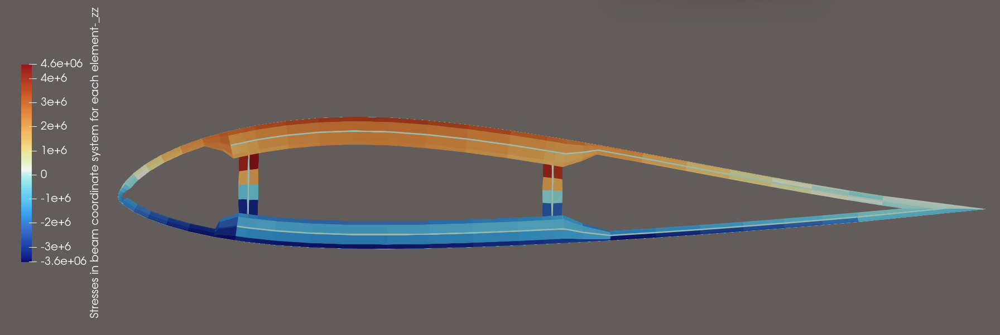

### [简体中文](./README.md) | [繁體中文](./README_FCN.md) | [English](./README_EN.md) | [日本語](./README_JP.md) | [한국어](./README_KO.md)

## 如果你想獲取完整代碼，並參加 HawtC2 的開發，請加入我們的組織

## HawtC 優勢

### 理論創新

*   1、基於四元數的運動學變換方法，打破 FAST[1](#user-content-fn-1)/Bladed 的小角度假設，實現了高精度運動描述和計算
*   2、具有自主知識產權的截面特性計算方法，打破 IVABS 和 BECAS 的長期壟斷
*   3、全耦合的高效多目標優化算法，支持氣動-結構-控制-水動力全流程優化設計，打破傳統人工優化設計的低效性
*   4、基於共旋方法建立了各向異性幾何非線性共旋梁方法，打破了傳統拉格朗日方法和幾何精確梁方法的低效性，實現了少分段、大步長、高精度的葉片非線性計算。
*   5、首次基於 Kane 方法推導了葉片、塔架 TMDI 的運動學和動力學公式，並將其耦合到了多體動力學當中，實現了氣動-結構-控制-水動力-TMDI 控制的全鏈路耦合計算。借助接口模型 APIL 與多目標優化模塊 MoptL 實現了複雜風-波-浪耦合的葉片 TMDI 多目標優化設計
*   提出了即時數據驅動與多目標耦合的優化算法，通過建立真實數據參考向量，解決了傳統數據驅動方法預測結果差，模型泛化能力弱的問題，大幅提高了優化效率和預測精度。
*   攻克了葉片鋪層（結構設計）-葉片翼型應力（安全性設計）-葉片氣動（高效氣動外形設計）的超長柔性葉片耦合設計難題，實現了大型機組的翼型-葉片-整機耦合的設計方法，並提供了建模和仿真工具。

### 技術創新

*   完全的 100%基於 c#的原生代碼，採用面向對象的編程形式，打破仿真軟件的國外壟斷
*   2、具有完全的 CLI 系統、支持介面/命令雙向操作的面向開發者的可執行命令
*   3、提供了面向 Python/c++等用戶的動態鏈接庫和手冊支持，方便與其他軟體耦合

## 0、如何使用？

HawtC 是部分開源且免費使用的計算軟體，需要您申請免費的許可證來使用，我們提供了自動化的許可證管理系統，您只需要登入我們的

網站：[http://www.hawtc.cn](http://www.hawtc.cn) 或 [http://www.openwecd.fun/](http://www.openwecd.fun/) 獲取支持！

## 01、當前開發進度與功能

我們的目標是實現 Bladed 的全工況覆蓋，並逐步開發 UI 界面（技術驗證已經完成！，使用 C# AOT 來實現界面，可下載 HawtC.UI 來體驗預覽）與 Bladed 的模組功能對比實現進度：

#### 01.1 功能與模組對比

| Bladed 模組 | OpenFAST 對應模組 | HawtC 對應模組 | HawtC 完成進度與支持情況 | HawtC 模型 |
| --- | --- | --- | --- | --- |
| 模態分析 | Bmodes（非 OpenFAST 模組） | BeamL | ✅基本實現，仍在開發 | ✅CR/✅TK/⚠️GEBT |
| 風力紊流 | TurbSim | WindL.SimWind | ✅完成 | 諧波疊加、風譜模型 |
| 地震生成 | 地震 | SubFEML | ❌ 已規劃，未開發 | 線性有限元 |
| 海況 | 海況(V4.0.0) | HydroL.WaveL | ✅完成 | JS/PM 譜模型 |
| 水動力模組 | HydroDyn | HyderoL | ⚠️只支持 Spar 平台 | ❌勢流理論（計劃開發）、✅Morison 方程 |
| 空氣動力學資訊 | AeroDyn | AeroL/BeamL | ✅完成 | BEMT/FVM 以及動態失速 Oye |
| 性能係數 | AeroDyn（不支持柔性 Cp） | AeroL/BeamL | ✅完成，❌柔性 Cp 未開發，可以使用 MBD 平替 | \- |
| 穩定功率曲線 | AeroDyn | TurbineL | ✅完成 | \- |
| 穩定操作負載 | AeroDyn | TurbineL | ✅完成 | \- |
| 穩定停機載荷 | AeroDyn | TurbineL | ✅完成 | 浮動座標法 |
| 模型線性化 | FAST 主模組 | MSAL/TurbineL | ⚠️ 正在開發當中。。。 | \- |
| 電氣性能 | \- | \- | ❌ 不支持 | \- |
| 功率生產負載 | BeamDyn/ElastoDyn | AeroL/MBD /ControL /HydroL/SubFEML/BeamL | ✅ 完成 | 耦合模型 |
| 正常停止 | \- | AeroL/MBD /ControL /HydroL/SubFEML/BeamL | ⚠️ 可以模擬，但是沒有直接提供功能選擇，開發中 | 耦合模型 |
| 緊急停止 | \- | AeroL/MBD//ControL /HydroL/SubFEML/BeamL | ❌ 錯誤控制模組位於 ControL 當中，尚未開發 | 耦合模型 |
| 怠速 | BeamDyn/ElastoDyn | AeroL/MBD /BeamL | ✅完成 | 耦合模型 |
| 停車 | BeamDyn/ElastoDyn | AeroL/MBD /HydroL/SubFEML/BeamL | ✅完成 | 耦合模型 |
| 硬體測試 | \- | \- | ❌ 不支持 | \- |
| 後處理 | \- | PostL | ✅ 部分支持（年發電量、疲勞載荷、極限載荷、雨流計數已完全支持！） | S-N 疲勞損傷理論、雨流計數法 |
| Bladed API | pyOpenFAST | APIL | 外部應用介面，獨有且便捷 | \- |
| Batch | ❌ 不支持 | 批次 | ⚠️ 支援大部分工況的批次處理和運行，但程式碼尚未完善 | \- |

#### 01.2 獨有功能

| Bladed 模組 | OpenFAST 模組 | HawtC 對應模組 | 功能 | 原理與模型 |
| --- | --- | --- | --- | --- |
| ❌不支持 | IVABS（非 OpenFAST 模組） | ✅ PCSL | 梁截面參數計算工具，獨有 | FEM |
| ❌不支持 | ❌不支持 | ✅ MoptL | 多目標並行優化算法程式，獨有 | NSGA2/GDE3/MCell（改進的多執行緒 c#實現） |
| ❌不支持 | ❌不支持 | ✅ APIL/MoptL | 整機全參數一體化優化，獨有 | 耦合模型 |
| ❌不支持 | ❌不支持 | ✅ WTAI/MoptL | 數據驅動與實時數據驅動代理模塊，獨有 | Python、C++接口以及內置 BP 神經網絡 |
| ❌不支持 | ✅ VTK 支援 | ✅ VTKL | 數據顯示與動畫輸出模組 | \- |
| ❌僅支援 TMD | ⚠️只支持 TMD（支持基礎/塔架/葉片等結構） | ✅ TMD/TMDI（獨有葉片）/陀螺儀 | TMD/TMDI/陀螺儀下的減振計算 | MBD/FEM 多體動力學-有限元耦合模型的耦合 |

## HawtC 與 OpenFAST/Bladed 4.11 計算驗證對比

### 1\. 與 OpenFAST 對比的陸上 IEA 15MW 穩態無風剪切驗證

#### 1）驗證結果

[http://www.openwecd.fun/data/稳态无风剪切Compare.html](http://www.openwecd.fun/data/%E7%A8%B3%E6%80%81%E6%97%A0%E9%A3%8E%E5%89%AA%E5%88%87Compare.html)

#### 2）驗證程序

[http://www.openwecd.fun/data/稳态Compare.ipynb](http://www.openwecd.fun/data/%E7%A8%B3%E6%80%81Compare.ipynb)

### 2\. 與 OpenFAST 對比的陸上 IEA 15MW 湍流風的驗證

#### 1）驗證結果

[http://www.openwecd.fun/data/湍流Compare.html](http://www.openwecd.fun/data/%E6%B9%8D%E6%B5%81Compare.html)

#### 2）驗證程序

[http://www.openwecd.fun/data/湍流Compare.ipynb](http://www.openwecd.fun/data/%E6%B9%8D%E6%B5%81Compare.ipynb)

### 3\. HawtC.AeroL 氣動力模組與 Bladed 4.11 計算驗證對比

### 4.HawtC.MBD.VTK 多體動力學可視化的 NREL 5MW Spar 海上漂浮式風力機測試

#### HAWTC.FARM:

### 5.HawtC.BeamL 非線性梁(3D 共旋梁理論)模組的驗證

### 6.HawtC.HydroL.Wave 水動力波浪生成模組驗證

該模組已經通過了與 Bladed 4.11 的驗證，如下圖所示：左面為 Bladed 4.11 的波浪譜，右面為 HawtC2 計算的波浪譜。

| Blade | HawtC |
| --- | --- |
|  |  |

### 7.HawtC.HydroL.MoorL 水動力波浪生成模組驗證

該模組完全耦合了 OpenMoor[2](#user-content-fn-2) 與 MoorDyn[3](#user-content-fn-3) 模組，以計算系泊力。同時，我們自己的系泊動力學 MoorL 模組還在開發當中，以支持風場狀態下的共享系泊。 

圖片來源於 [http://openmoor.org/](http://openmoor.org/)

### 8.HawtC.PCSL 截面特性計算驗證

Beta V2.0.014 及其之後版本支持 FEM 方法計算截面特性以及翼型網格自動化算法，輸入文件參考了 PreComp 開源軟體的輸入格式，但是算法完全不一致。該軟體包支持 API 函數自定義計算實現。

#### 案例1 典型截面的自定義網格分析（以矩形橫截面分析）

##### 1、輸入文件定義：

主輸入文件

##### 2、材料輸入文件定義：

材料輸入文件

##### 3、PCSL 計算:

案例網格:

計算結果:

該算例以和 BECAS 交叉驗證，計算結果完全一致！

#### 案例2 異形截面的自動化網格生成與計算（以翼型為例）

##### 1、輸入主文件定義：

主輸入文件

初始的翼型上下弦線幾何外形為:

##### 3、基於 PCSL 網格自動化算法生成的網格為:

###### 3.1 截面特性分析計算:

計算結果

###### 3.2 截面應力與應變分析:

PCSL 支持外部力輸入下的截面應力/應變計算及其失效分析計算方法。上述翼型的應力/應變以及失效分析主文件:

應變分析:

應力分析:

網格自動加密：

失效分析：

##### 4、當前的問題

當前 V2.0.014 版本採用 Q4 單元對截面進行離散，當前模型不能考慮高階插值函數，使得與彎曲和剪切相關的係數計算精度相對較差（但遠比 PreComp 精確）。該問題我們將在 2.0.015 版本當中引入 Q8 單元來解決。但是，為了加速計算，我們考慮到葉片單元的閉合殼結構和葉片的小應變特點，我們在代碼當中忽略了截面翹曲的能量。如果需要計算非閉合截面，請等待年度更新的 V2.1.000 大版本！

### 9.HawtC.WindL.SimWind 湍流風生成模組驗證

該模組與 OpenFAST.TurbSim 模組功能類似，下面是 ETM 風模型：

### 10.HawtC.MoptL 整機一體化優化模組數據驅動腳本

請查閱文件，了解範例接口：

*   腳本類語言接口(Python/R/Julia/Matlab): BP 神經網絡模型:[DemoBPNetWork.py](./data/Mopt/Python%E8%84%9A%E6%9C%AC/DemoBPNetWork.py)
    
    自然神經網絡模型:[DemoBPNetWork.py](./data/Mopt/Python%E8%84%9A%E6%9C%AC/DemoBPNetWork.py)
    
*   編譯型語言接口(C/C++/Fortran/c#):
    
    c++接口模板:[MoptL 數據驅動案例.sln](./data/Mopt/C++%E8%84%9A%E6%9C%AC/MoptL%E6%95%B0%E6%8D%AE%E9%A9%B1%E5%8A%A8%E6%A1%88%E4%BE%8B/MoptL%E6%95%B0%E6%8D%AE%E9%A9%B1%E5%8A%A8%E6%A1%88%E4%BE%8B.sln)
    

## 源代碼下載

請訪問 [www.HawtC.cn](http://www.openwecd.fun/)

## 交流論壇

交流論壇 [http://www.openwecd.fun:22304/](http://www.openwecd.fun:22304/)

#### 參考文獻

## 註腳

1.  [https://github.com/OpenFAST/openfast](https://github.com/OpenFAST/openfast) [↩](#user-content-fnref-1)
    
2.  Chen, L., Basu, B. & Nielsen, S.R.K. (2018). 用於浮動式海上風力發電機分析的耦合有限差分系泊動力學模型。海洋工程, 162, 304-315 [↩](#user-content-fnref-2)
    
3.  [https://github.com/FloatingArrayDesign/MoorDyn?tab=readme-ov-file](https://github.com/FloatingArrayDesign/MoorDyn?tab=readme-ov-file) [↩](#user-content-fnref-3)