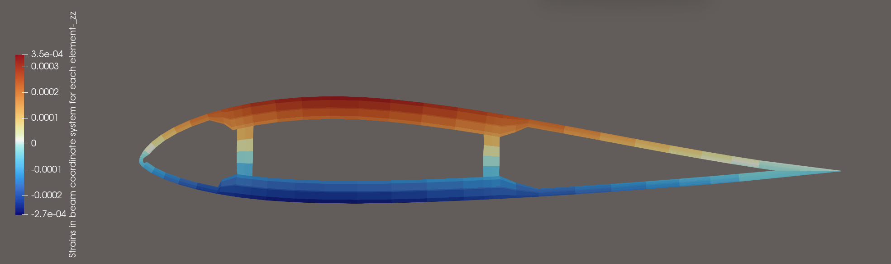
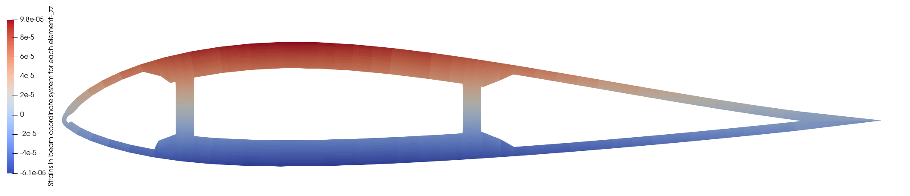

### [简体中文](./README.md) | [繁體中文](./README_FCN.md) | [English](./README_EN.md) | [日本語](./README_JP.md) | [한국어](./README_KO.md)

## 完全なコードを取得し、HawtC2の開発に参加したい場合は、私たちの組織に参加してください

## HawtCの利点

### 理論的革新

*   四元数に基づく運動学変換方法により、FAST[1](#user-content-fn-1) /Bladedの小角度仮定を打破し、高精度の運動記述と計算を実現しました。
*   自主知的財産権を有する断面特性計算方法により、IVABSとBECASの長期的な独占を打破しました。
*   全耦合の効率的な多目的最適化アルゴリズムにより、空力-構造-制御-水動力の全プロセス最適化設計をサポートし、従来の人工最適化設計の非効率性を打破しました。
*   共旋法に基づいて異方性幾何非線形共旋梁方法を確立し、従来のラグランジュ法と幾何精確梁方法の非効率性を打破し、少分割、大ステップ、高精度のブレード非線形計算を実現しました。
*   5、Kane法に基づいて初めてブレード、タワーTMDIの運動学と動力学の公式を導き出し、それを多体動力学に結合させ、空力-構造-制御-水力-TMDI制御の全リンク結合計算を実現しました。インターフェースモデルAPILと多目的最適化モジュールMoptLを利用して、複雑な風-波-浪結合のブレードTMDI多目的最適化設計を実現しました。
*   6、リアルタイムデータ駆動と多目的結合の最適化アルゴリズムを提案し、実際のデータ参照ベクトルを構築することで、従来のデータ駆動方法の予測結果が悪く、モデルの汎化能力が弱いという問題を解決し、最適化効率と予測精度を大幅に向上させました。
*   7、ブレード積層（構造設計）-ブレード翼型応力（安全性設計）-ブレード空力（効率的な空力形状設計）の超長柔性ブレード結合設計の難題を克服し、大型機組の翼型-ブレード-全機結合の設計方法を実現し、モデリングとシミュレーションツールを提供しました。

### 技術革新

*   1、完全にC#に基づくネイティブコードで、オブジェクト指向プログラミング形式を採用し、シミュレーションソフトウェアの海外独占を打破
*   2、完全なCLIシステムを備え、インターフェース/コマンドの双方向操作をサポートする開発者向けの実行可能コマンド
*   3、Python/c++などのユーザー向けに動的リンクライブラリとマニュアルサポートを提供し、他のソフトウェアとの結合を容易にする

## 0、使用方法は？

HawtCは部分的にオープンソースで無料で使用できる計算ソフトウェアであり、使用するには無料のライセンスを申請する必要があります。私たちは自動化されたライセンス管理システムを提供しており、あなたは私たちの

ウェブサイト：[http://www.hawtc.cn](http://www.hawtc.cn) または [http://www.openwecd.fun/](http://www.openwecd.fun/) にログインしてサポートを受けることができます！

## 01、現在の開発進捗と機能

私たちの目標はBladedの全工況カバーを実現し、UIインターフェースを徐々に開発することです（技術検証はすでに完了しています！C# AOTを使用してインターフェースを実現し、HawtC.UIをダウンロードしてプレビューを体験できます）。Bladedのモジュール機能との比較による実現進捗：

#### 01.1 機能とモジュールの比較

| Bladedモジュール | OpenFAST対応モジュール | HawtC対応モジュール | HawtC完成進捗とサポート状況 | HawtCモデル |
| --- | --- | --- | --- | --- |
| モーダル解析 | Bmodes（非OpenFASTモジュール） | ビームL | ✅基本実装、開発中 | ✅CR/✅TK/⚠️GEBT |
| 風の乱流 | TurbSim | WindL.SimWind | ✅完成 | 調和重ね合わせ、風スペクトルモデル |
| 地震発生 | 地震 | SubFEML | ❌ 計画済み、未開発 | 線形有限要素 |
| 海況 | 海況(V4.0.0) | HydroL.WaveL | ✅完成 | JS/PM 谱モデル |
| 水動力モジュール | HydroDyn | HyderoL | ⚠️Sparプラットフォームのみ対応 | ❌勢流理論（開発予定）、✅Morison方程式 |
| 空力情報 | AeroDyn | AeroL/BeamL | ✅完成 | BEMT/FVM および動的失速Oye |
| 性能係数 | AeroDyn（柔性Cpはサポートされていません） | AeroL/BeamL | ✅完了,❌ 柔性Cpは未開発、MBDで代替可能 | \- |
| 定常出力曲線 | AeroDyn | TurbineL | ✅完成 | \- |
| 定常運転荷重 | AeroDyn | TurbineL | ✅完成 | \- |
| 定常駐車荷重 | AeroDyn | TurbineL | ✅完成 | 浮動座標法 |
| モデル線形化 | FAST主モジュール | MSAL/タービンL | ⚠️ 開発中。。。 | \- |
| 電気性能 | \- | \- | ❌ サポートされていません | \- |
| 電力生産負荷 | BeamDyn/ElastoDyn | AeroL/MBD /ControL /HydroL/SubFEML/BeamL | ✅完成 | 結合モデル |
| 通常停止 | \- | AeroL/MBD/ControL/HydroL/SubFEML/BeamL | ⚠️ シミュレーションは可能ですが、直接機能選択は提供されていません。開発中です。 | 結合モデル |
| 緊急停止 | \- | AeroL/MBD//ControL /HydroL/SubFEML/BeamL | ❌ エラー制御モジュールはControLにあり、まだ開発されていません | 結合モデル |
| アイドリング | BeamDyn/ElastoDyn | AeroL/MBD /BeamL | ✅完成 | カップリングモデル |
| 駐車 | BeamDyn/ElastoDyn | AeroL/MBD /HydroL/SubFEML/BeamL | ✅完成 | カップリングモデル |
| ハードウェアテスト | \- | \- | ❌ サポートされていません | \- |
| 後処理 | \- | PostL | ✅ 部分支持（年発電量、疲労荷重、極限荷重、雨流計数は完全にサポート！） | S-N疲労損傷理論、雨流計数法 |
| ブレードAPI | pyOpenFAST | APIL | 外部アプリケーションインターフェース、独自で便利 | \- |
| バッチ | ❌ サポートされていません | バッチ | ⚠️ 大部分の作業条件におけるバッチ処理と実行をサポートしていますが、コードはまだ完成していません | \- |

#### 01.2 独自機能

| Bladedモジュール | OpenFASTモジュール | HawtC対応モジュール | 機能 | 原理とモデル |
| --- | --- | --- | --- | --- |
| ❌サポートされていません | IVABS（OpenFASTモジュールではない） | ✅ PCSL | 梁断面パラメータ計算ツール、独自 | FEM |
| ❌サポートされていません | ❌サポートされていません | ✅ MoptL | 多目標並行最適化アルゴリズムプログラム、独自 | NSGA2/GDE3/MCell（改良されたマルチスレッドc#実装） |
| ❌サポートされていません | ❌サポートされていません | ✅ APIL/MoptL | 整機全パラメータ一体化最適化、独自 | カップリングモデル |
| ❌サポートされていません | ❌サポートされていません | ✅ WTAI/MoptL | データ駆動およびリアルタイムデータ駆動エージェントモジュール、独自 | Python、C++インターフェースおよび内蔵BPニューラルネットワーク |
| ❌サポートされていません | ✅ VTKサポート | ✅ VTKL | データ表示とアニメーション出力モジュール | \- |
| ❌TMDのみ対応 | ⚠️TMDのみ対応（基礎/タワー/ブレードなどの構造をサポート） | ✅ TMD/TMDI（独自ブレード）/ジャイロスコープ | TMD/TMDI/ジャイロスコープによる減振計算 | MBD/FEM 多体動力学-有限要素結合モデルの結合 |

## HawtC と OpenFAST/Bladed 4.11 計算検証比較

### 1\. OpenFASTとの比較による陸上IEA 15MWの定常無風剪切検証

#### 1）検証結果

[http://www.openwecd.fun/data/稳态无风剪切Compare.html](http://www.openwecd.fun/data/%E7%A8%B3%E6%80%81%E6%97%A0%E9%A3%8E%E5%89%AA%E5%88%87Compare.html)

#### 2）検証プログラム

[http://www.openwecd.fun/data/稳态Compare.ipynb](http://www.openwecd.fun/data/%E7%A8%B3%E6%80%81Compare.ipynb)

### 2\. OpenFASTと比較した陸上IEA 15MW乱流風の検証

#### 1）検証結果

[http://www.openwecd.fun/data/湍流Compare.html](http://www.openwecd.fun/data/%E6%B9%8D%E6%B5%81Compare.html)

#### 2）検証プログラム

[http://www.openwecd.fun/data/湍流Compare.ipynb](http://www.openwecd.fun/data/%E6%B9%8D%E6%B5%81Compare.ipynb)

### 3.HawtC.AeroL 気動力モジュールと Bladed 4.11 計算検証比較

### 4.HawtC.MBD.VTK 多体動力学可視化のNREL 5MW Spar海上浮体式風力機テスト

#### HAWTC.FARM:

### 5.HawtC.BeamL 非線形梁(3D共旋梁理論)モジュールの検証

### 6.HawtC.HydroL.Wave 水動力波浪生成モジュールの検証

このモジュールはBladed 4.11との検証を通過しました。以下の図に示されています：左側はBladed 4.11の波浪スペクトル、右側はHawtC2で計算された波浪スペクトルです。

| ブレード | HawtC |
| --- | --- |
|  |  |

### 7.HawtC.HydroL.MoorL 水動力波浪生成モジュールの検証

このモジュールはOpenMoor[2](#user-content-fn-2)とMoorDyn[3](#user-content-fn-3)モジュールを完全に結合して、係留力を計算します。同時に、私たち自身の係留動力学MoorLモジュールも開発中であり、風場状態での共有係留をサポートします。 

画像の出典：[http://openmoor.org/](http://openmoor.org/)

### 8.HawtC.PCSL 断面特性計算の検証

Beta V2.0.014およびその後のバージョンは、FEM法を用いた断面特性の計算および翼型メッシュの自動化アルゴリズムをサポートしています。入力ファイルはPreCompオープンソースソフトウェアの入力形式を参考にしていますが、アルゴリズムは完全に異なります。このソフトウェアパッケージは、API関数を用いたカスタム計算の実装をサポートしています。

#### ケース1 典型的な断面のカスタムメッシュ解析（矩形断面解析）

##### 1、入力ファイルの定義：

主入力ファイル

##### 材料入力ファイルの定義:

材料入力ファイル

##### PCSL 計算:

ケースグリッド:

計算結果:

この算例はBECASと交差検証を行い、計算結果は完全に一致しました！

#### ケース2 異形断面の自動化メッシュ生成と計算（翼型を例として）

##### 1、メインファイルの定義を入力:

主入力ファイル

初期の翼型上下弦線の幾何形状は:

##### 3、PCSLメッシュ自動化アルゴリズムに基づいて生成されたメッシュは:

###### 3.1 断面特性分析計算:

計算結果

###### 3.2 断面応力とひずみ分析:

PCSLは外部力入力下での断面応力/ひずみ計算およびその破壊分析計算方法をサポートします。上記翼型の応力/ひずみおよび破壊分析主ファイル:

ひずみ分析:

応力解析:

メッシュ自動暗号化:

破損解析:

##### 4、現在の問題

現在のV2.0.014バージョンでは、Q4要素を使用して断面を離散化していますが、現在のモデルでは高次補間関数を考慮することができず、曲げやせん断に関連する係数の計算精度が相対的に低くなっています（ただし、PreCompよりははるかに正確です）。この問題は、2.0.015バージョンでQ8要素を導入することで解決する予定です。しかし、計算を高速化するために、ブレード要素の閉じたシェル構造とブレードの小さなひずみの特徴を考慮し、コード内で断面のねじれエネルギーを無視しています。非閉じた断面を計算する必要がある場合は、年次更新のV2.1.000大バージョンをお待ちください！

### 9.HawtC.WindL.SimWind 湍流風生成モジュール検証

このモジュールはOpenFAST.TurbSimモジュールの機能に類似しており、以下はETM風モデルです：

### 10.HawtC.MoptL 整機一体化最適化モジュールデータ駆動スクリプト

ファイルを参照して、インターフェースの例を確認してください:

*   スクリプト言語インターフェース(Python/R/Julia/Matlab): BP神経ネットワークモデル:[DemoBPNetWork.py](./data/Mopt/Python%E8%84%9A%E6%9C%AC/DemoBPNetWork.py)
    
    自然神経ネットワークモデル:[DemoBPNetWork.py](./data/Mopt/Python%E8%84%9A%E6%9C%AC/DemoBPNetWork.py)
    
*   コンパイル言語インターフェース(C/C++/Fortran/c#):
    
    c++インターフェーステンプレート:[MoptLデータ駆動ケース.sln](./data/Mopt/C++%E8%84%9A%E6%9C%AC/MoptL%E6%95%B0%E6%8D%AE%E9%A9%B1%E5%8A%A8%E6%A1%88%E4%BE%8B/MoptL%E6%95%B0%E6%8D%AE%E9%A9%B1%E5%8A%A8%E6%A1%88%E4%BE%8B.sln)
    

## ソースコードダウンロード

[www.HawtC.cn](http://www.openwecd.fun/)をご訪問ください

## 交流フォーラム

交流フォーラム [http://www.openwecd.fun:22304/](http://www.openwecd.fun:22304/)

#### 参考文献

## 脚注

1.  [https://github.com/OpenFAST/openfast](https://github.com/OpenFAST/openfast) [↩](#user-content-fnref-1)
    
2.  Chen, L., Basu, B. & Nielsen, S.R.K. (2018). 浮体式洋上風力タービン解析のための結合有限差分係留動力学モデル。Ocean Engineering, 162, 304-315 [↩](#user-content-fnref-2)
    
3.  [https://github.com/FloatingArrayDesign/MoorDyn?tab=readme-ov-file](https://github.com/FloatingArrayDesign/MoorDyn?tab=readme-ov-file) [↩](#user-content-fnref-3)