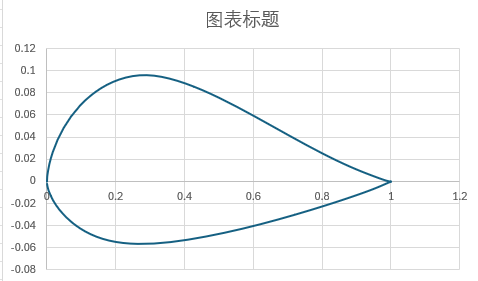
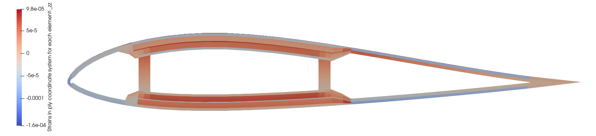

### [简体中文](./README.md) | [繁體中文](./README_FCN.md) | [English](./README_EN.md) | [日本語](./README_JP.md) | [한국어](./README_KO.md)

## 전체 코드를 얻고 HawtC2 개발에 참여하고 싶다면 우리의 조직에 가입하세요

## HawtC의 장점

### 이론적 혁신

*   1、사원수 기반 운동학 변환 방법은 FAST[1](#user-content-fn-1) /Bladed의 작은 각도 가정을 깨고, 고정밀 운동 묘사와 계산을 실현했습니다.
*   2、자주적 지식 재산권을 가진 단면 특성 계산 방법은 IVABS와 BECAS의 장기 독점을 깨뜨렸습니다.
*   3、전 결합의 고효율 다목적 최적화 알고리즘은 공기역학-구조-제어-수력학 전 과정 최적화 설계를 지원하며, 전통적인 인공 최적화 설계의 비효율성을 깨뜨렸습니다.
*   4、공회전 방법을 기반으로 이방성 기하 비선형 공회전 빔 방법을 구축하여, 전통적인 라그랑주 방법과 기하학적 정확 빔 방법의 비효율성을 깨고, 적은 분할, 큰 보폭, 고정밀의 블레이드 비선형 계산을 실현했습니다.
*   5\. Kane 방법을 기반으로 처음으로 블레이드, 타워 TMDI의 운동학 및 동역학 공식을 유도하고 이를 다물체 동역학에 결합하여 공기역학-구조-제어-수력학-TMDI 제어의 전체 링크 결합 계산을 실현했습니다. 인터페이스 모델 APIL과 다목적 최적화 모듈 MoptL을 통해 복잡한 바람-파도-물결 결합의 블레이드 TMDI 다목적 최적화 설계를 구현했습니다.
*   6\. 실시간 데이터 기반 및 다목적 결합 최적화 알고리즘을 제안하여, 실제 데이터 참조 벡터를 구축함으로써 전통적인 데이터 기반 방법의 예측 결과가 좋지 않고 모델의 일반화 능력이 약한 문제를 해결하여 최적화 효율과 예측 정확도를 크게 향상시켰습니다.
*   7\. 블레이드 적층(구조 설계)-블레이드 익형 응력(안전성 설계)-블레이드 공기역학(효율적인 공기역학 외형 설계)의 초장 유연 블레이드 결합 설계 난제를 극복하여 대형 기종의 익형-블레이드-전체 기계 결합 설계 방법을 실현하고 모델링 및 시뮬레이션 도구를 제공했습니다.

### 기술 혁신

*   1、완전한 100% C# 기반의 네이티브 코드로, 객체 지향 프로그래밍 형식을 채택하여 시뮬레이션 소프트웨어의 해외 독점을 타파합니다
*   2、완전한 CLI 시스템을 갖추고 있으며, 인터페이스/명령의 양방향 조작을 지원하는 개발자 지향 실행 명령을 제공합니다
*   3、Python/c++ 등 사용자에게 동적 링크 라이브러리와 매뉴얼 지원을 제공하여 다른 소프트웨어와의 결합을 용이하게 합니다

## 0、사용 방법?

HawtC는 부분적으로 오픈 소스이며 무료로 사용할 수 있는 계산 소프트웨어로, 사용을 위해 무료 라이선스를 신청해야 합니다. 우리는 자동화된 라이선스 관리 시스템을 제공하며, 귀하는 우리의

웹사이트: [http://www.hawtc.cn](http://www.hawtc.cn) 또는 [http://www.openwecd.fun/](http://www.openwecd.fun/)에 로그인하여 지원을 받을 수 있습니다!

## 01\. 현재 개발 진행 상황 및 기능

우리의 목표는 Bladed의 모든 작업 조건을 포괄하는 것이며, 점진적으로 UI 인터페이스를 개발하는 것입니다(기술 검증은 이미 완료되었습니다! C# AOT를 사용하여 인터페이스를 구현하며, HawtC.UI를 다운로드하여 미리보기를 경험할 수 있습니다). Bladed의 모듈 기능과 비교한 구현 진행 상황:

#### 01.1 기능 및 모듈 비교

| Bladed 모듈 | OpenFAST 대응 모듈 | HawtC 대응 모듈 | HawtC 완료 진행 및 지원 상황 | HawtC 모델 |
| --- | --- | --- | --- | --- |
| 모달 분석 | Bmodes(비OpenFAST 모듈) | BeamL | ✅기본 구현, 아직 개발 중 | ✅CR/✅TK/⚠️GEBT |
| 풍력 난류 | TurbSim | WindL.SimWind | ✅완료 | 조화 중첩, 풍력 스펙트럼 모델 |
| 지진 발생 | 지진 | SubFEML | ❌ 계획됨, 미개발 | 선형 유한 요소 |
| 해상 상태 | 해상 상태(V4.0.0) | HydroL.WaveL | ✅완료 | JS/PM 스펙트럼 모델 |
| 수력학 모듈 | HydroDyn | HyderoL | ⚠️ Spar 플랫폼만 지원 | ❌ 유동 이론 (개발 예정), ✅ Morison 방정식 |
| 공기역학 정보 | AeroDyn | AeroL/BeamL | ✅완료 | BEMT/FVM 및 동적 실속 Oye |
| 성능 계수 | AeroDyn(유연한 Cp 지원하지 않음) | AeroL/BeamL | ✅완료,❌ 유연한 Cp 미개발, MBD로 대체 가능 | \- |
| 안정적인 출력 곡선 | AeroDyn | TurbineL | ✅완료 | \- |
| 지속적인 운영 하중 | AeroDyn | TurbineL | ✅완료 | \- |
| 안정적인 주차 하중 | 에어로다인 | 터빈엘 | ✅완료 | 부동 좌표법 |
| 모델 선형화 | FAST 주 모듈 | MSAL/터빈L | ⚠️ 개발 중입니다... | \- |
| 전기 성능 | \- | \- | ❌ 지원하지 않음 | \- |
| 전력 생산 부하 | BeamDyn/ElastoDyn | AeroL/MBD /ControL /HydroL/SubFEML/BeamL | ✅완료 | 결합 모델 |
| 정상 정지 | \- | AeroL/MBD/ControL/HydroL/SubFEML/BeamL | ⚠️ 시뮬레이션은 가능하지만 직접적인 기능 선택은 제공되지 않으며 개발 중입니다 | 결합 모델 |
| 비상 정지 | \- | AeroL/MBD//ControL /HydroL/SubFEML/BeamL | ❌ 오류 제어 모듈은 ControL에 위치하며, 아직 개발되지 않음 | 결합 모델 |
| 공회전 | BeamDyn/ElastoDyn | AeroL/MBD /BeamL | ✅완료 | 결합 모델 |
| 주차됨 | BeamDyn/ElastoDyn | AeroL/MBD /HydroL/SubFEML/BeamL | ✅완료 | 결합 모델 |
| 하드웨어 테스트 | \- | \- | ❌ 지원하지 않음 | \- |
| 후처리 | \- | PostL | ✅ 부분 지원 (연간 발전량, 피로 하중, 극한 하중, 레인플로우 카운트는 완전히 지원!) | S-N 피로 손상 이론, 레인플로우 카운트법 |
| 블레이드 API | pyOpenFAST | APIL | 외부 응용 프로그램 인터페이스, 독창적이고 편리함 | \- |
| 배치 | ❌ 지원하지 않음 | 배치 | ⚠️ 대부분의 작업 조건에서 배치 처리 및 실행을 지원하지만 코드가 아직 완벽하지 않음 | \- |

#### 01.2 고유 기능

| Bladed 모듈 | OpenFAST 모듈 | HawtC 대응 모듈 | 기능 | 원리와 모델 |
| --- | --- | --- | --- | --- |
| ❌지원하지 않음 | IVABS(비OpenFAST 모듈) | ✅ PCSL | 梁 단면 매개변수 계산 도구, 독창적 | FEM |
| ❌지원하지 않음 | ❌지원하지 않음 | ✅ MoptL | 다목적 병렬 최적화 알고리즘 프로그램, 독창적 | NSGA2/GDE3/MCell(개선된 다중 스레드 c# 구현) |
| ❌지원하지 않음 | ❌지원하지 않음 | ✅ APIL/MoptL | 전체 기기 전 매개변수 통합 최적화, 독창적 | 결합 모델 |
| ❌지원하지 않음 | ❌지원하지 않음 | ✅ WTAI/MoptL | 데이터 기반 및 실시간 데이터 기반 에이전트 모듈, 독점적 | Python, C++ 인터페이스 및 내장 BP 신경망 |
| ❌지원하지 않음 | ✅ VTK 지원 | ✅ VTKL | 데이터 표시 및 애니메이션 출력 모듈 | \- |
| ❌TMD만 지원 | ⚠️TMD만 지원(기초/타워/블레이드 등 구조 지원) | ✅ TMD/TMDI(독점 블레이드)/자이로스코프 | TMD/TMDI/자이로스코프 하의 감쇠 계산 | MBD/FEM 다체 동역학-유한 요소 결합 모델의 결합 |

## HawtC와 OpenFAST/Bladed 4.11 계산 검증 비교

### 1\. OpenFAST와 비교한 육상 IEA 15MW 정상 상태 무풍 전단 검증

#### 1) 검증 결과

[http://www.openwecd.fun/data/稳态无风剪切Compare.html](http://www.openwecd.fun/data/%E7%A8%B3%E6%80%81%E6%97%A0%E9%A3%8E%E5%89%AA%E5%88%87Compare.html)

#### 2）검증 프로그램

[http://www.openwecd.fun/data/稳态Compare.ipynb](http://www.openwecd.fun/data/%E7%A8%B3%E6%80%81Compare.ipynb)

### 2\. OpenFAST와 비교한 육상 IEA 15MW 난류 풍의 검증

#### 1）검증 결과

[http://www.openwecd.fun/data/湍流Compare.html](http://www.openwecd.fun/data/%E6%B9%8D%E6%B5%81Compare.html)

#### 2）검증 프로그램

[http://www.openwecd.fun/data/湍流Compare.ipynb](http://www.openwecd.fun/data/%E6%B9%8D%E6%B5%81Compare.ipynb)

### 3.HawtC.AeroL 기동력 모듈과 Bladed 4.11 계산 검증 비교

### 4.HawtC.MBD.VTK 다체 동역학 시각화의 NREL 5MW Spar 해상 부유식 풍력기 테스트

#### HAWTC.FARM:

### 5.HawtC.BeamL 비선형 빔(3D 공회전 빔 이론) 모듈의 검증

### 6.HawtC.HydroL.Wave 수력학적 파랑 생성 모듈 검증

이 모듈은 Bladed 4.11과의 검증을 통과했으며, 아래 그림과 같이 나타납니다: 왼쪽은 Bladed 4.11의 파랑 스펙트럼이고, 오른쪽은 HawtC2에서 계산된 파랑 스펙트럼입니다.

| Blade | HawtC |
| --- | --- |
|  |  |

### 7.HawtC.HydroL.MoorL 수력학적 파랑 생성 모듈 검증

이 모듈은 OpenMoor[2](#user-content-fn-2)와 MoorDyn[3](#user-content-fn-3) 모듈을 완전히 결합하여 계류력을 계산합니다. 동시에, 우리의 자체 계류 동역학 MoorL 모듈은 풍장 상태에서의 공유 계류를 지원하기 위해 개발 중에 있습니다. 

이미지 출처: [http://openmoor.org/](http://openmoor.org/)

### 8.HawtC.PCSL 단면 특성 계산 검증

Beta V2.0.014 및 이후 버전은 FEM 방법을 사용하여 단면 특성과 익형 그리드 자동화 알고리즘을 계산하는 것을 지원하며, 입력 파일은 PreComp 오픈 소프트웨어의 입력 형식을 참조했지만 알고리즘은 완전히 다릅니다. 이 소프트웨어 패키지는 API 함수 사용자 정의 계산 구현을 지원합니다.

#### 사례 1: 직사각형 단면 분석을 통한 전형적인 단면의 사용자 정의 그리드 분석

##### 1\. 입력 파일 정의:

주 입력 파일

##### 2、재료 입력 파일 정의:

재료 입력 파일

##### 3、PCSL 계산:

사례 그리드:

계산 결과:

이 계산 예는 BECAS와 교차 검증하여, 계산 결과가 완전히 일치합니다!

#### 사례 2 비정형 단면의 자동화 메쉬 생성 및 계산(익형을 예로)

##### 1\. 주 파일 정의 입력:

주 입력 파일

초기의 익형 상하현선 기하학적 외형은:

##### 3\. PCSL 격자 자동화 알고리즘에 기반하여 생성된 격자는:

###### 3.1 단면 특성 분석 계산:

계산 결과

###### 3.2 단면 응력 및 변형 분석:

PCSL은 외부 힘 입력 하에서의 단면 응력/변형 계산 및 그 실패 분석 계산 방법을 지원합니다. 위의 익형의 응력/변형 및 실패 분석 주 파일:

변형 분석:

응력 분석:

메쉬 자동 암호화:

파손 분석:

##### 4\. 현재의 문제

현재 V2.0.014 버전은 Q4 유닛을 사용하여 단면을 이산화하며, 현재 모델은 고차 보간 함수를 고려할 수 없어 굽힘 및 전단과 관련된 계수 계산의 정확도가 상대적으로 낮습니다(그러나 PreComp보다 훨씬 정확합니다). 이 문제는 2.0.015 버전에서 Q8 유닛을 도입하여 해결할 것입니다. 그러나 계산 속도를 높이기 위해, 우리는 블레이드 유닛의 폐쇄 껍질 구조와 블레이드의 작은 변형 특성을 고려하여 코드에서 단면 뒤틀림의 에너지를 무시했습니다. 비폐쇄 단면을 계산해야 하는 경우, 연간 업데이트 V2.1.000 대형 버전을 기다려 주십시오!

### 9.HawtC.WindL.SimWind 난류 바람 생성 모듈 검증

이 모듈은 OpenFAST.TurbSim 모듈과 유사한 기능을 가지며, 아래는 ETM 바람 모델입니다:

### 10.HawtC.MoptL 전체 기계 통합 최적화 모듈 데이터 구동 스크립트

파일을 참조하여 예제 인터페이스를 확인하십시오:

*   스크립트 언어 인터페이스(Python/R/Julia/Matlab): BP 신경망 모델:[DemoBPNetWork.py](./data/Mopt/Python%E8%84%9A%E6%9C%AC/DemoBPNetWork.py)
    
    자연 신경망 모델:[DemoBPNetWork.py](./data/Mopt/Python%E8%84%9A%E6%9C%AC/DemoBPNetWork.py)
    
*   컴파일 언어 인터페이스(C/C++/Fortran/c#):
    
    c++ 인터페이스 템플릿:[MoptL 데이터 드라이븐 사례.sln](./data/Mopt/C++%E8%84%9A%E6%9C%AC/MoptL%E6%95%B0%E6%8D%AE%E9%A9%B1%E5%8A%A8%E6%A1%88%E4%BE%8B/MoptL%E6%95%B0%E6%8D%AE%E9%A9%B1%E5%8A%A8%E6%A1%88%E4%BE%8B.sln)
    

## 소스 코드 다운로드

[www.HawtC.cn](http://www.openwecd.fun/)를 방문하십시오

## 교류 포럼

교류 포럼 [http://www.openwecd.fun:22304/](http://www.openwecd.fun:22304/)

#### 참고문헌

## 각주

1.  [https://github.com/OpenFAST/openfast](https://github.com/OpenFAST/openfast) [↩](#user-content-fnref-1)
    
2.  Chen, L., Basu, B. & Nielsen, S.R.K. (2018). 부유식 해상 풍력 터빈 분석을 위한 결합 유한 차분 계류 동역학 모델. Ocean Engineering, 162, 304-315 [↩](#user-content-fnref-2)
    
3.  [https://github.com/FloatingArrayDesign/MoorDyn?tab=readme-ov-file](https://github.com/FloatingArrayDesign/MoorDyn?tab=readme-ov-file) [↩](#user-content-fnref-3)